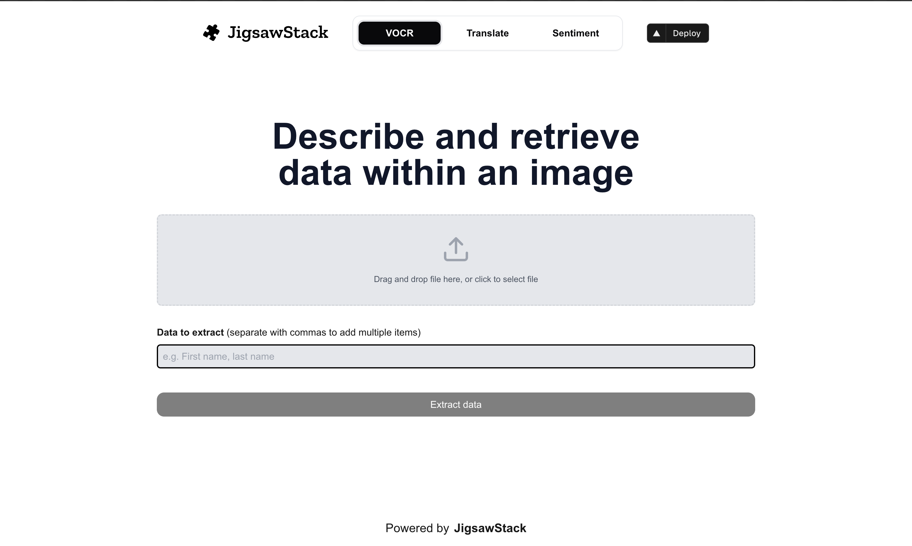

# [JigsawStack](https://www.jigsawStack.com)

This project uses JigsawStack's AI SDK to:

- extract information from images
- perform sentiment analysis on a given text
- translate text to a target language

## Running Locally

1. Create an account at [JigsawStack](https://www.jigsawStack.com) and add your API key under `NEXT_PUBLIC_JIGSAWSTACK_PUBLIC_KEY` in your `.env`
3. Run the application with `npm run dev` and it will be available at `http://localhost:3000`.

## One-Click Deploy

Deploy the example using [Vercel](https://vercel.com?utm_source=github&utm_medium=readme&utm_campaign=vercel-examples):

